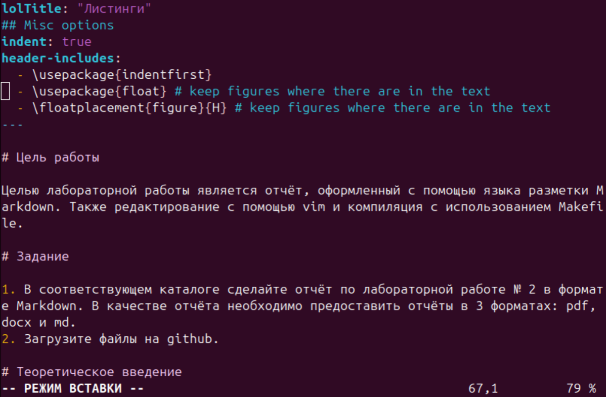

# Отчёт по лабораторной работе №3

**Автор**: Хорошева Алёна Евгеньевна

## Содержание

1. [Цель работы](#цель-работы)
2. [Задание](#задание)
3. [Теоретическое введение](#теоретическое-введение)
4. [Выполнение лабораторной работы](#выполнение-лабораторной-работы)
5. [Выводы](#выводы)
6. [Список литературы](#список-литературы)

## Цель работы

Целью лабораторной работы является отчёт, оформленный с помощью языка разметки Markdown. Также редактирование с помощью vim и компиляция с использованием Makefile.

## Задание

В соответствующем каталоге сделайте отчёт по лабораторной работе № 2 в формате Markdown. В качестве отчёта необходимо предоставить отчёты в 3 форматах: pdf, docx и md.

Загрузите файлы на GitHub.

## Теоретическое введение

### 1. Базовые сведения о Markdown

- Чтобы создать заголовок, используйте знак `#`, например:
  - `# This is heading 1`
  - `## This is heading 2`
  - `### This is heading 3`
  - `#### This is heading 4`

- Чтобы задать для текста **полужирное** начертание, заключите его в двойные звездочки:
  - `**This text is bold.**`

- Чтобы задать для текста *курсивное* начертание, заключите его в одинарные звездочки:
  - `*This text is italic.*`

- Для **полужирного и курсивного**:
  - `***This is text is both bold and italic.***`

- Блоки цитирования создаются с помощью символа `>`:
  - `> Example quote`

### 2. Форматы списков

Упорядоченные списки:
1. First instruction
2. Second instruction

Неупорядоченные списки:
- List item 1
- List item 2

### 3. Ссылки и код

- Синтаксис Markdown для ссылок: `[link text](file-name.md)`
- Блоки кода:

```markdown
your code goes in here
```

### 4. Оформление формул и изображений

- Формула: `sin^2(x) + cos^2(x) = 1`

- Вставка изображений:
  - Пример: ``

## Выполнение лабораторной работы

1. Обновляю локальный репозиторий с помощью команды git pull
  
2. Использую команду `make` для генерации файлов отчёта. Проверяю наличие файлов в папке вручную.
  
  
3. Командой `make clean` удаляю ненужные файлы. Проверяю, что их больше нет в папке report. 
  
  
4. Открываю файл `report.md` с помощью редактора `vim` и заполняю его согласно шаблону.
  
  
  
  

## Выводы

По итогам лабораторной работы сформирован отчёт с использованием Markdown и текстового редактора vim. 

Информация из теоретического введения помогла освоить навыки работы с Markdown.

## Список литературы

1. Документация по Markdown